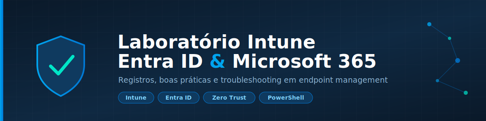

**Registro de práticas, configurações e troubleshooting em um ambiente de laboratório Microsoft 365 — Intune, Entra ID e automações de TI**

---

## 📖 Sobre

Este repositório documenta, de forma estruturada, as ações e práticas realizadas em um laboratório pessoal focado em **Microsoft Intune**, **Microsoft Entra ID** e no ecossistema **Microsoft 365**. Cada configuração testada vira um registro reprodutível — com contexto, passo a passo, problemas encontrados e evidências — servindo tanto como base de conhecimento pessoal quanto como referência aberta para quem também trabalha ou está aprendendo administração de endpoints Microsoft.

Se você caiu aqui procurando como resolver algo específico no Intune ou Entra ID, veja a [tabela de registros](#-registros-disponíveis) ou os [guias](#-guias) abaixo — é bem provável que já tenha um passo a passo pronto.

## 📑 Índice

- [Estrutura do repositório](#️-estrutura-do-repositório)
- [Guias](#-guias)
- [Registros disponíveis](#-registros-disponíveis)
- [Ferramentas utilizadas](#️-ferramentas-utilizadas)
- [Scripts](#️-scripts)
- [Configurações exportadas](#-configurações-exportadas)
- [Roadmap / tópicos cobertos](#-roadmap--tópicos-cobertos)
- [Convenção de commits](#-convenção-de-commits)
- [Como usar este repositório](#-como-usar-este-repositório)
- [Aviso](#️-aviso)

## 🗂️ Estrutura do repositório

lab-intune-entraid/
├── README.md # Este arquivo
├── LICENSE # Licença MIT
├── docs/
│ ├── assets/ # Banner e imagens usadas no README
│ ├── modelos/ # Modelo reutilizável para novos registros
│ ├── configuracoes/ # Exports de políticas e configurações aplicadas
│ ├── guias/ # Guias de referência e boas práticas (não amarrados a uma sessão específica)
│ └── ferramentas.md # Catálogo de ferramentas usadas no laboratório
├── registro-intune/ # Um arquivo markdown por prática/sessão
├── scripts/ # Scripts organizados por finalidade
│ ├── intune-apps/
│ ├── intune-remediation/
│ ├── intune-store-policy/
│ ├── intune-compliance-termo/
│ └── forticlient-vpn/
└── evidencias/ # Screenshots e evidências visuais
└── autopilot/

## 📘 Guias

Diferente dos registros (que documentam uma prática específica), os guias reúnem **boas práticas gerais**, revisitadas conforme o laboratório evolui.

| Guia | Descrição |
|---|---|
| [Boas práticas: do zero até o dispositivo "Managed"](./docs/guias/boas-praticas-gerenciamento-dispositivos.md) | Licenciamento, estrutura de grupos, Scope Tags, ordem correta de configuração e checklist completo até o dispositivo ficar `Managed` no Intune |

## 📚 Registros disponíveis

| Registro | Área | Descrição |
|---|---|---|
| [Hardening do Tenant Entra ID — CA MFA, Permissões, Grupos e Zero Trust](./registro-intune/entra-id-hardening-zero-trust.md) | Entra ID | Política de MFA para todos, conta de emergência, revisão de permissões (PIM), grupos de segurança, KMSI e princípios de Zero Trust |
| [MDM Enrollment em Hybrid Azure AD Joined](./registro-intune/mdm-enrollment-hybrid.md) | Entra ID / Intune | Auto-enrollment em ambiente Hybrid: DNS split-brain, GPO e exceções de Conditional Access |
| [Troubleshooting: Service Principal ausente](./registro-intune/troubleshooting-service-principal-intune-enrollment.md) | Entra ID | App não aparece no picker do Conditional Access — provisionamento manual via Microsoft Graph |
| [Autopilot Devices — Hybrid Join](./registro-intune/autopilot-hybrid-join.md) | Intune | Configuração completa de dispositivos Autopilot com domain join híbrido |
| [Secure Boot e TPM 2.0 — Readiness Windows 11](./registro-intune/secureboot-tpm-windows11-readiness.md) | Intune | Detecção e remediação remota (quando possível) de Secure Boot/TPM via Proactive Remediation |
| [Bloqueio de Acesso por Termo de Responsabilidade](./registro-intune/bloqueio-termo-responsabilidade-intune.md) | Entra ID / Intune | Custom Compliance vinculando o Termo de Responsabilidade (FO.TI.05) ao Intune via flag em compartilhamento de rede, Termos de Uso e Conditional Access |

> Novos registros seguem o [modelo padrão](./docs/modelos/modelo-registro.md) e devem ser adicionados a esta tabela. Conteúdo de boas práticas **geral** (não específico de uma sessão) vai em [`docs/guias/`](./docs/guias), não em `registro-intune/`, para evitar duplicação.

## 🛠️ Ferramentas utilizadas

Veja o catálogo completo em [`docs/ferramentas.md`](./docs/ferramentas.md) — inclui:

- **Win32 Content Prep Tool** (`IntuneWinAppUtil.exe`) — conversão de instaladores `.msi`/`.exe` em pacotes `.intunewin` para deploy de Win32 Apps
- **Microsoft Graph PowerShell SDK** — administração de Entra ID/Intune via script
- **Get-WindowsAutopilotInfo** — extração de Hardware Hash para registro no Autopilot
- **WinGet** — instalação de apps sem empacotamento manual
- Ferramentas de BIOS por fabricante (Dell Command \| Configure, HP CMSL, Lenovo WMI)
- Comandos de diagnóstico (`dsregcmd /status`, Event Viewer, Company Portal)

## ⚙️ Scripts

| Pasta | Conteúdo |
|---|---|
| [`intune-apps/`](./scripts/intune-apps) | Instalação de apps via winget e criação de atalhos no desktop |
| [`intune-remediation/`](./scripts/intune-remediation) | Remediation proativa: aviso de reinicialização, detecção/remediação de Secure Boot e TPM 2.0 |
| [`intune-store-policy/`](./scripts/intune-store-policy) | Bloqueio/reversão de acesso à Microsoft Store |
| [`intune-compliance-termo/`](./scripts/intune-compliance-termo) | Custom Compliance: discovery script, sincronização via Microsoft Graph e registro manual de fallback para o Termo de Responsabilidade |
| [`forticlient-vpn/`](./scripts/forticlient-vpn) | Empacotamento Win32 do FortiClient VPN para deploy via Intune |

## 📋 Configurações exportadas

Em [`docs/configuracoes/`](./docs/configuracoes): exports de políticas de Intune (OneDrive/SharePoint), layout de taskbar customizado, e configuração de atalho PWA para sistema de chamados. Detalhes em [`docs/configuracoes/README.md`](./docs/configuracoes/README.md).

## 🧭 Roadmap / tópicos cobertos

Tópicos já documentados ou em andamento neste laboratório:

- [x] Hybrid Azure AD Join + auto-enrollment MDM
- [x] Conditional Access + Service Principal troubleshooting
- [x] Autopilot com domain join híbrido
- [x] Windows 11 readiness (Secure Boot / TPM 2.0)
- [x] Deploy de Win32 Apps (FortiClient VPN como exemplo)
- [x] Boas práticas de licenciamento, grupos e ordem de configuração
- [x] Hardening de tenant: CA MFA all users, permissões, grupos de segurança, KMSI, Zero Trust
- [x] Custom Compliance + Termos de Uso + Conditional Access (bloqueio por Termo de Responsabilidade)
- [ ] Identity Protection (User risk / Sign-in risk)
- [ ] Compliance policies detalhadas (próximo registro)
- [ ] Configuration Profiles (ADMX ingestion, OMA-URI customizados)
- [ ] Co-management com Configuration Manager
- [ ] Windows Update for Business / Update rings

## 📝 Convenção de commits

| Prefixo | Uso |
|---|---|
| `registro:` | Nova entrada de prática/log |
| `guia:` | Novo guia ou atualização de boas práticas gerais |
| `script:` | Novo script ou alteração em script |
| `doc:` | Atualização de documentação/modelo |
| `fix:` | Correção de erro em registro ou script anterior |

Exemplo: `git commit -m "registro: teste de política de compliance no Intune"`

## 🚀 Como usar este repositório

1. Cada prática vira um arquivo em `registro-intune/`, nomeado como `AAAA-MM-DD-titulo-curto.md`.
2. Use o [modelo de registro](./docs/modelos/modelo-registro.md) como ponto de partida.
3. Boas práticas **gerais**, não amarradas a uma sessão específica, vão em `docs/guias/` — se um registro específico repetir conteúdo já coberto por um guia, o registro deve linkar o guia em vez de duplicar.
4. Scripts vão em `scripts/<categoria>/`, evidências em `evidencias/`.
5. Ferramentas novas usadas em algum registro entram em [`docs/ferramentas.md`](./docs/ferramentas.md).
6. Ao adicionar um novo registro ou guia, inclua-o na tabela correspondente e, se aplicável, marque no roadmap.

## ⚠️ Aviso

Este é um ambiente de laboratório/estudo. Nenhuma informação sensível de ambiente de produção real (senhas, tokens, domínios corporativos reais) deve ser incluída — segredos devem ficar em variáveis de ambiente ou cofres de segredos, nunca versionados.

---

Feito por [Andre Luiz](https://github.com/4ndreLuiz2807) — laboratório de estudo em Microsoft 365, Intune e Entra ID.

