# Passo a Passo Intune — Autopilot Devices (Hybrid Join)

**Área:** Intune / Entra ID
**Objetivo:** Configurar dispositivos Autopilot com domain join híbrido (RH como setor de referência)

---

## Padrões de nomes de grupos utilizados

| Finalidade | Padrão |
|---|---|
| Domain Join | `GRP – Domain Join – Hybrid – (RH)` |
| Grupo de dispositivos dinâmico | `GRP – Autopilot Devices – (RH)` |

## Passo a passo realizado

### 1. Criar OU no controlador para os devices pós-writeback

Criar a Unidade Organizacional onde os dispositivos ficarão após o writeback do Entra ID Connect.

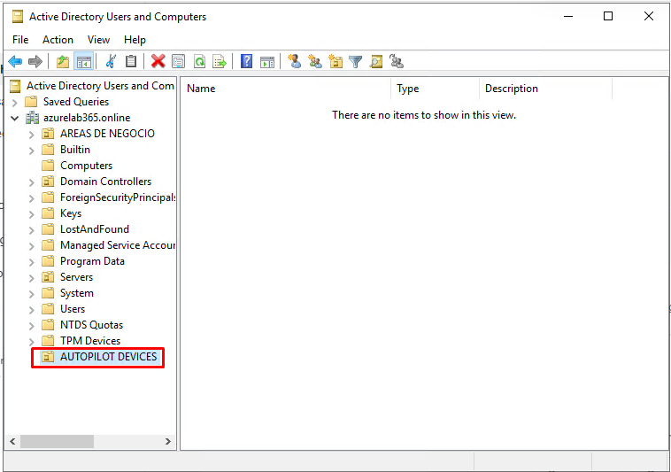

**1.2 — Delegar controle** sobre a OU criada:

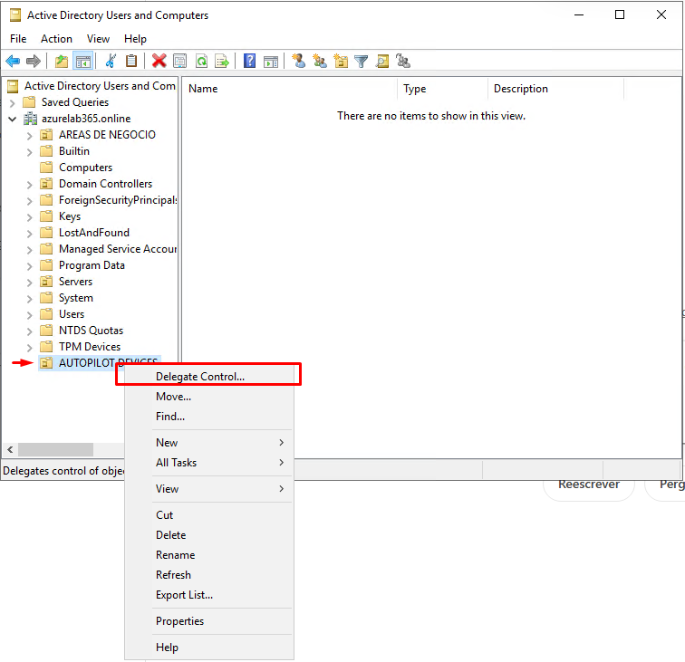

**1.3 — Adicionar o controlador de domínio** para ter controle sobre a OU:

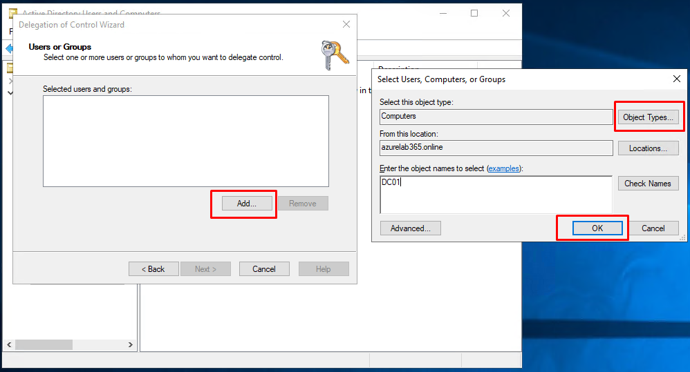
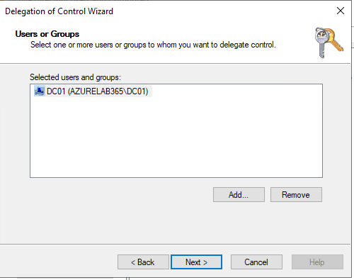

**1.4 — Criar tarefas customizadas de delegação:**

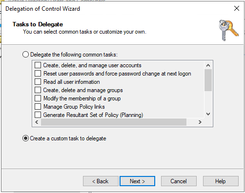

**1.5 — Delegar permissões de criação/exclusão de computadores:**

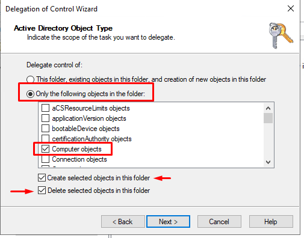

**1.6 — Selecionar todas as permissões:**

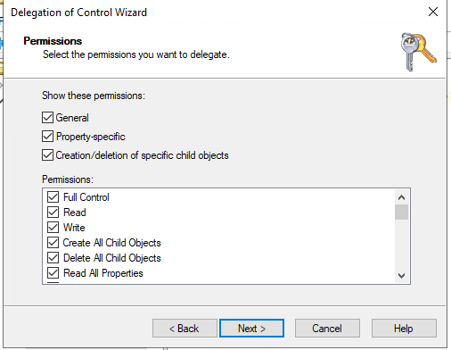

**1.7 — Primeiro passo concluído:**

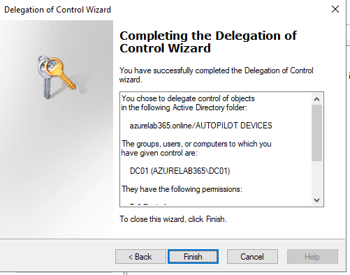

### 2. Configurações no portal do Intune

Link: https://intune.microsoft.com/#home

Criar um grupo de dispositivo dinâmico para devices Autopilot: **Groups → New Group**

- Grupo: `GRP – Autopilot – Hybrid – RH`
- ⚠️ Grupos de usuários **não** fazem autopilot devices — apenas dispositivos.

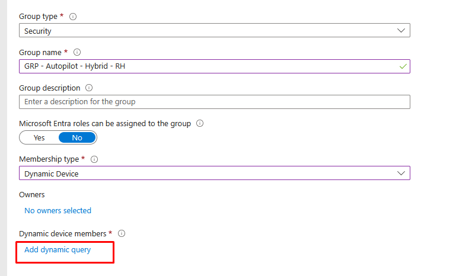

**2.1 — Regra dinâmica (Group Tag):**

```
(device.devicePhysicalIds -any (_ -eq "[OrderID]:RH"))
```

O Group Tag usado neste exemplo é RH, mas pode ser adaptado para outros setores — basta trocar o sufixo:
```
(device.devicePhysicalIds -any (_ -eq "[OrderID]:TI"))
(device.devicePhysicalIds -any (_ -eq "[OrderID]:ADM"))
```

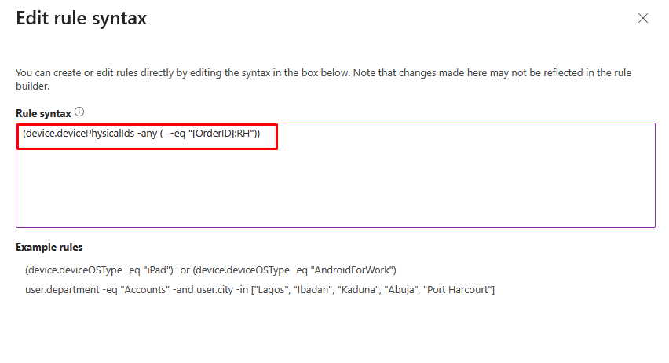

### 3. Configurar Domain Join (ingresso no domínio local durante o OOBE)

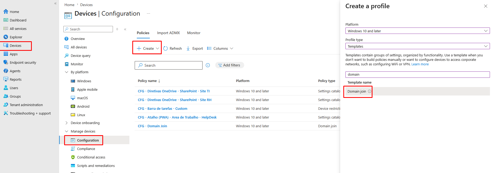
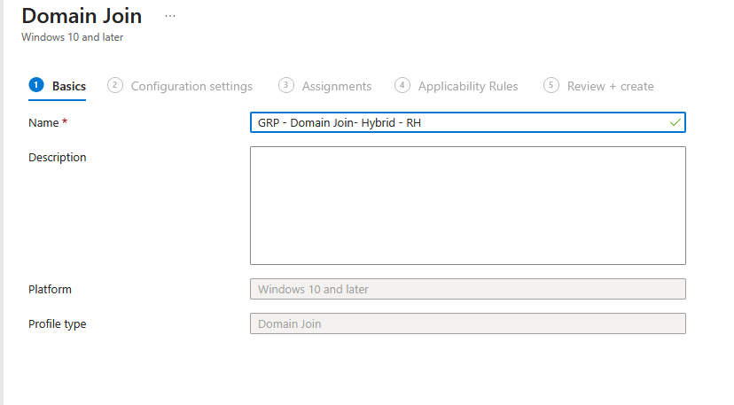

**3.1 — Parâmetros de configuração:**
- 3.1.1 Configurar o prefixo dos dispositivos
- 3.1.2 Configurar domínio
- 3.1.3 Configurar a Unidade Organizacional onde os dispositivos ficarão

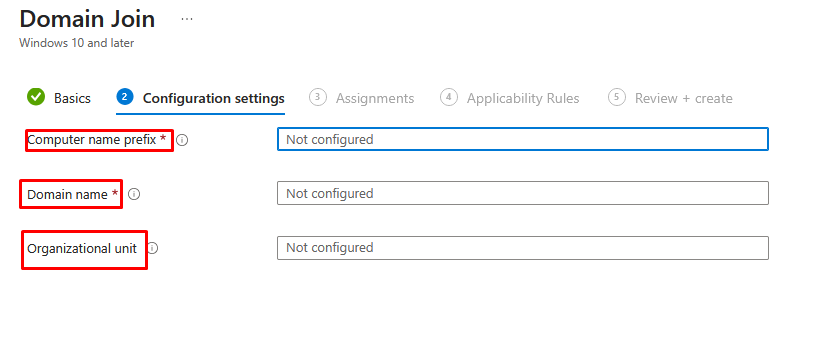

### 4. Criar o perfil de implantação Autopilot (AP)

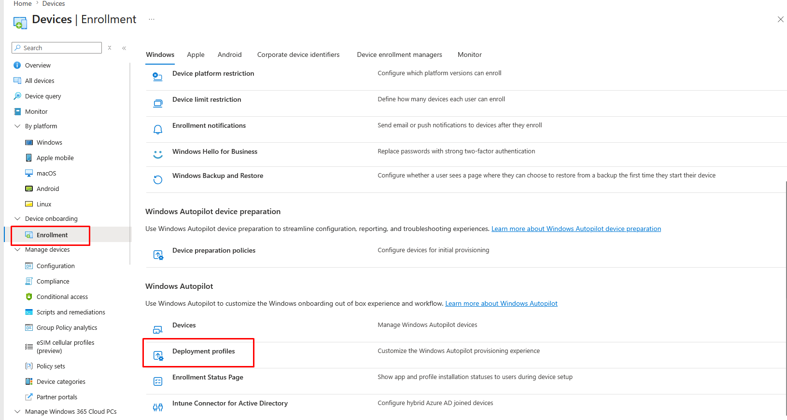

### 5. Comando Autopilot V1 — rodar no dispositivo

Gera o arquivo com o HWID do dispositivo, necessário para registrar no Autopilot:

```powershell
[Net.ServicePointManager]::SecurityProtocol = [Net.SecurityProtocolType]::Tls12

New-Item -ItemType Directory -Path "C:\HWID" -Force
Set-Location -Path "C:\HWID"
$env:Path += ";C:\Program Files\WindowsPowerShell\Scripts"
Set-ExecutionPolicy -Scope Process -ExecutionPolicy RemoteSigned -Force
Install-Script -Name Get-WindowsAutopilotInfo -Force

# Obtém o hostname da máquina
$Hostname = $env:COMPUTERNAME

# Define o nome do arquivo CSV com o hostname
$OutputFile = "C:\HWID\$Hostname-AutopilotHWID.csv"

Get-WindowsAutopilotInfo -OutputFile $OutputFile
```

### 6. Desabilitar ESP via OMA-URI

```
OMA URI: ./Vendor/MSFT/DMClient/Provider/MS DM Server/FirstSyncStatus/SkipUserStatusPage
```

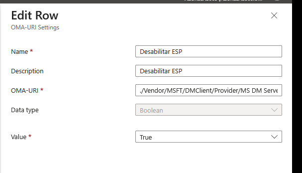

## Aprendizados / próximos passos

- O Group Tag é a forma de segmentar dispositivos Autopilot por setor sem precisar de múltiplos perfis de implantação separados.
- A ordem importa: a OU e a delegação de permissões no AD precisam existir **antes** de configurar o domain join no Intune, senão o writeback falha silenciosamente.
